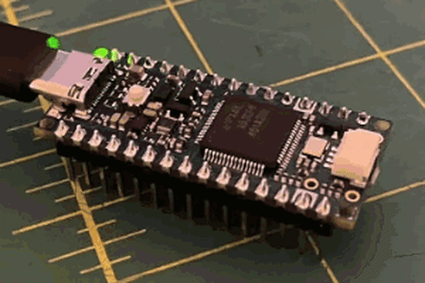
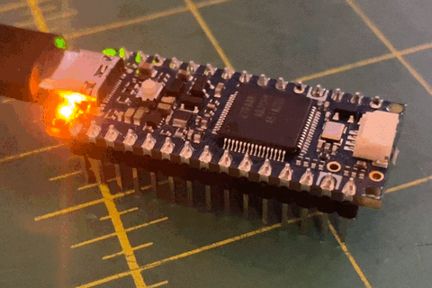

# LED Curve Studio

**[Open LED Curve Studio](https://robomaniac.github.io/led-curve-studio/)**: use the app directly in your browser, with no download, installation, or local launcher. Desktop Chrome/Edge also supports **experimental browser flashing**.

A dependency-free LED animation designer that runs entirely in one `index.html`.

Table of contents

- [Use it](#use-it)
- [Saving and sharing](#saving-and-sharing)
- [Program an Arduino from Chrome (experimental)](#program-an-arduino-from-chrome-experimental)
- [Example animation](#example-animation)
- [Simulation and real hardware](#simulation-and-real-hardware)
- [Inspiration](#inspiration)
- [Guides](#guides)

  

## Use it

1. Open **[LED Curve Studio](https://robomaniac.github.io/led-curve-studio/)** in your browser. You should see the sample photo and a moving playhead; **Pause** means playback is running. If the page fails to load, check the address and your connection before continuing.
2. Choose a preset, adjust **Cycle speed**, or drag curve points. Double-click the curve to add a point or a non-endpoint handle to remove it.
3. To use your own photo, choose **Change image** or drop it onto the preview. Choose **Edit LED**, drag the light into position, then use its handles to resize and rotate it.
4. Adjust the LED's color, shape, and glow. Drag the orange playhead to inspect a moment, or use **Pause** to stop playback.
5. Choose **Export GIF** to save an animation, or **Download project** to save your editable design with its photo.

The sample plays a cyan-blue double pulse every **1.70 seconds**, with smoothing and linked endpoints. **Use sample** restores that photo, placement, and animation; download your current project first if you want to keep it.

For offline use or local editing, follow the [Windows setup guide](docs/SETUP.md#run-locally-on-windows). Design and export work by opening `index.html` directly; browser flashing needs the live HTTPS app or the included localhost launcher.

## Saving and sharing

Your settings and photos stay in your browser; animation processing runs locally.

| Action | Result |
| --- | --- |
| **Export GIF** | An animated preview, with a choice of duration and loop information. |
| **Download project** | Your editable design, including its photo. |
| **Copy JSON** | Curve and LED placement settings, without the image. |
| **Import** | Opens a saved project or settings JSON. |
| **Arduino code** | A sketch to copy or download for use in Arduino IDE. |

## Program an Arduino from Chrome (experimental)

Desktop Chrome/Edge offers direct programming for **Nano R4**, **Uno R3 / ATmega328P**, and **classic Nano / ATmega328P**. Other boards can use code export where compatible.

**Browser flashing is experimental.** Automated tests use simulated devices; repeatable uploads on physical boards have not been confirmed for this release. AVR uploads include readback verification; Nano R4 uploads do not. Programming overwrites the board's current sketch.

Follow the [complete programming instructions](docs/SETUP.md#program-an-arduino), including board selection, USB permissions, success checks, and recovery steps.

## Example animation

  

An example GIF exported from the editor. You can export your own animation with **Export GIF**.

## Simulation and real hardware

| Simulation (1 Hz) | Physical Arduino Nano R4 |
| :---: | :---: |
|  |  |

The simulation and a physical Arduino Nano R4 are shown side by side. In person, the board's yellow LED is much brighter than this recording conveys. Both GIFs are cropped to the same size; their original animation timing is preserved, so the loops are not synchronized.

If the GIFs do not play automatically on GitHub

The GIFs loop continuously. GitHub can pause them according to each viewer's [accessibility settings](https://docs.github.com/en/account-and-profile/how-tos/account-settings/managing-accessibility-settings#managing-motion).

1. In your browser, sign in to GitHub and open [Settings > Accessibility](https://github.com/settings/accessibility). Find **Motion**; sign in first if prompted.
2. Set **Autoplay animated images** to **Enabled** and confirm it is selected.
3. Return to this README and reload. Both LEDs should blink without clicking Play. If they remain still, recheck the setting in the same account or use each image's Play button. No rebuild or redeployment is needed; the README cannot override a viewer's preference.

## Inspiration

LED Curve Studio began after I watched Clicks’ [“We could have designed a new BlackBerry. Here’s why we didn’t.”](https://www.youtube.com/watch?v=fLwi43Tcaj8&t=244s). The interface shown at 4:04 sparked a simple challenge: “I could vibe-code this.” This project is my AI-assisted recreation of that interface, developed into a working browser-based editor for designing, previewing, and exporting LED animations.

## Guides

- [Setup and troubleshooting](docs/SETUP.md): local launch, sample settings, Arduino programming, USB drivers, and recovery.
- [Development and publishing](docs/DEVELOPMENT.md): checkout checks, regression tests, firmware changes, and GitHub Pages updates.
- [Firmware rebuild instructions](firmware/README.md): optional compiler setup and the packaged firmware's build status.
- [Image assets](images/README.md): sample photo edits and the matching GIF crops.
