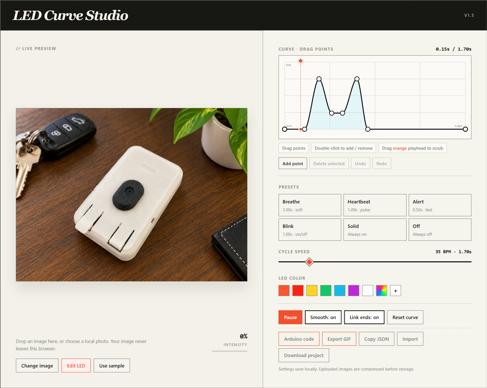
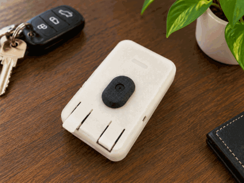

# LED Curve Studio

**[Open LED Curve Studio](https://robomaniac.github.io/led-curve-studio/)**: use the app directly in your browser, with no download, installation, or local launcher. Desktop Chrome/Edge also supports **experimental browser flashing**.

A dependency-free LED animation designer that runs entirely in one `index.html`.

<p align="center">
  <a href="images/led-curve-studio-overview.png"></a>
</p>

## Inspiration

LED Curve Studio began after I watched Clicks’ [“We could have designed a new BlackBerry. Here’s why we didn’t.”](https://www.youtube.com/watch?v=fLwi43Tcaj8&t=244s). The interface shown at 4:04 sparked a simple challenge: “I could vibe-code this.” This project is my AI-assisted recreation of that interface, developed into a working browser-based editor for designing, previewing, and exporting LED animations.

## Example animation

<p align="center">
  
</p>

An example GIF exported from the editor. You can export your own animation with **Export GIF**.

## Use it

1. In your browser, open **[LED Curve Studio](https://robomaniac.github.io/led-curve-studio/)**. The page should show the studio, its sample photo, and a moving playhead. **Pause** means the preview is playing. If the page does not load, stop and check the address and your internet connection. No local terminal is needed.
2. Choose **Change image** or drop a photo onto the preview.
3. Choose **Edit LED**, then drag the LED body to move it.
4. Use the corner and rotation handles to size and orient the light.
5. Pick a shape, color, glow spread, preset, and cycle speed.
6. Drag curve points to control brightness over time. Double-click the curve to add a point or a non-endpoint handle to remove it.

**Optional offline use:** download and extract the repository, then open `index.html` directly for design and export. No install, build step, web server, or network connection is required. For experimental Arduino programming from a local copy, use the [Windows launcher instructions below](#run-from-the-project-root-windows). The live HTTPS app also supports programming.

The sample starts with a cyan-blue (`#20cfff`) double pulse repeating every 1.70 seconds, with **Smooth** and **Link ends** on. This is a custom sample curve, so no preset is highlighted. The preview starts playing automatically whenever the page opens. Use **Pause** to stop it. The playhead can be dragged to preview a moment in the cycle. Keyboard users can nudge the LED with the arrow keys and edit selected curve points with the arrow and Delete keys.

### Open a local copy on Windows (optional)

Use these steps to run the files on your computer, including changes you have made locally. If you are using the live app linked above, you can skip this section. Local edits appear online only after they are pushed to `main` and GitHub Pages finishes deploying.

1. Press **Windows+E** to open **File Explorer**.
2. Open the folder where you extracted or cloned this repository. You should see `index.html`, `README.md`, and `Start LED Curve Studio.cmd` together. If you downloaded a ZIP, right-click it, choose **Extract All...**, complete extraction, and open the extracted folder first. If these files are missing, stop and locate the folder containing them before continuing.

3. Double-click **Start LED Curve Studio.cmd** in File Explorer. A terminal window opens and launches the studio in Chrome or Edge. Keep the terminal window open: it supplies the page to your browser. If the studio is already running, the launcher reuses it. If the terminal displays an error, stop at this step.
4. In **Chrome or Edge**, check the address bar at the top. For this checkout it is normally `http://localhost:8765/index.html`; if the terminal prints a different address after `Serving:` or `Reusing:`, use that address instead. The page should say **LED Curve Studio**. If Chrome displays **Profile error occurred**, follow [the Edge workaround below](#if-chrome-displays-a-profile-error).
5. With that browser tab selected, hold **Ctrl** and **Shift**, then press **R**. This reloads the changed files; restarting the terminal is unnecessary. The app header should show **v1.5**.
6. Below the photo on the left, click **Use sample**, beside **Edit LED**. This loads the new photo, aligns the LED, sets cyan blue, and starts the custom 1.70-second double-pulse animation with **Smooth** and **Link ends** on. If you want to retain a different design currently open, click **Download project** on the right before using **Use sample**.

**Success:** the photo shows the white ESP32 enclosure and a cyan LED pulsing twice in each 1.70-second cycle. **Smooth: on** and **Link ends: on** appear on the right, and no preset is highlighted because this is the custom sample curve. The playback button says **Pause**, which means the animation is running. Clicking it stops playback; it then says **Play**.

**If the page is already open:** continue from step 4. **If the browser says it cannot reach the page:** return to step 3 and check the terminal's printed address. No Arduino connection, firmware upload, Python test, or build is needed to watch this browser animation.

## Program an Arduino from Chrome (experimental)

**Experimental:** automated tests cover simulated USB/serial devices and application behavior. Repeatable uploads on physical boards have not yet been confirmed for this release, so successful tests do not guarantee a successful flash on your computer. Browser permissions, USB drivers, bootloader state, and board variants can affect uploading. AVR uploads include readback verification; Nano R4 uploads do not.

Use the live HTTPS app or the local launcher. Opening `index.html` directly from disk is for design and export only:

1. In **desktop Chrome or Edge**, open **[LED Curve Studio](https://robomaniac.github.io/led-curve-studio/)** and confirm the studio appears. No launcher is needed for the live app. For a local copy instead, double-click **Start LED Curve Studio.cmd** in the extracted project folder and keep its terminal window open. Launching it again reuses the running server, so the address stays stable (normally `http://localhost:8765`). Stop if the page fails to load.
2. In that Chrome/Edge tab, finish the curve and open **Arduino code**.
3. Select the board profile and LED output.
4. Close Arduino IDE's Serial Monitor and any other tab using the board, then click **Program…** and select the USB device/port. Firmware is downloaded and checked before the board is reset or written.
5. **Nano R4 only:** if the status asks for bootloader access, click **Program Nano R4** again and select **Nano R4 (Upgrade)**. If Upgrade is absent, cancel the picker, double-tap the board's **RESET** button, then click **Program Nano R4** again. The second selection grants access to the bootloader; permissions from localhost do not carry over to the hosted site.
6. Wait for completion. Uno/classic Nano reports **Programmed and verified** after reading every page back. Nano R4 reports that the firmware was accepted and the board restarted; this uploader does not read back Nano R4 flash. Confirm the physical LED runs the selected pattern. If an error appears, stop and follow its instruction before retrying.

Supported direct-programming profiles:

- **Arduino Nano R4** — WebUSB DFU; double-tap Reset if the Upgrade device is not listed.
- **Arduino Uno R3 / ATmega328P** — Web Serial STK500v1 at 115200 baud.
- **Classic Nano / ATmega328P** — new bootloader at 115200 baud or old bootloader at 57600 baud.

The browser checks the bundled firmware length, configuration, and SHA-256, then patches a snapshot of the current duration, output mode, pin, and 64 gamma-corrected samples into a copy. Board and output controls stay locked during programming. AVR uploads are read back and compared byte-for-byte before success is reported. Programming overwrites the board's current sketch. No browser C++ compiler or cloud service is involved.

Mega 2560, Leonardo/Micro, Nano Every, Uno R4 WiFi, SAMD/MKR, and ESP32 boards use other bootloader protocols; code export still works, but direct browser programming needs a board-specific profile.

## Saving and sharing

- Settings save automatically in browser storage.
- Uploaded images are resized to a maximum 1600 px edge and kept locally in IndexedDB.
- **Arduino code** generates a Nano R4 copy-paste sketch from the current curve and speed. Its built-in LED is `LED_BUILTIN` on internal pin 22 (not D13), driven with non-blocking software PWM, or an external LED can use D9 hardware PWM.
- **Export GIF** lets you choose 0.25–30 seconds of playback and shows the frame/cycle count plus whether the result loops seamlessly. The built-in dependency-free encoder renders at up to 480 px and only re-encodes the changing glow region to keep files small.
- **Copy JSON** shares the small animation and placement setup without the image.
- **Download project** includes the current image.
- **Import** accepts either format and validates values before applying them.

The bundled sample is `images/AI_esp32_assistant_unlit.png`, also embedded in the HTML for offline use. It is an unlit copy of the supplied ESP32 assistant photo, with a subtle ivory diffuser and a pill-shaped LED overlay aligned to it. The default glow spread is 0.75×. The live preview and GIF export use a translucent light core with gentle spill and no bright outline. The original `images/AI_esp32_assistant.png` is kept unchanged. See [image assets and edit prompt](images/README.md). Refresh to v1.5 to load the new default; if a custom photo is saved in your browser, click **Use sample** to switch to it. Existing edited animation curves are preserved. **Use sample** restores the photo, aligned LED, cyan color, and automatically playing custom double-pulse curve with a 1.70-second cycle, smoothing, and linked ends.

All animation processing stays in the browser. The app has no runtime dependencies or external services; direct Arduino programming fetches the included firmware from the same site or localhost server.

## Run from the project root (Windows)

Prerequisites: Windows PowerShell 5.1 (included with Windows) and Chrome or Edge for direct Arduino programming. No package installation or application build is needed. The included firmware binaries are ready to use; relocating the project does not require rebuilding or flashing a board.

1. Open **File Explorer**, open your extracted or cloned project folder (the one containing `index.html`), and double-click **Start LED Curve Studio.cmd**.

   Success: the launcher prints `Serving:` (or `Reusing:`) and opens the app. Keep the serving terminal open. The `.cmd` file starts `serve-studio.ps1` with the required options; you do not need to run that script separately. If a server error appears, stop and resolve it before attempting Arduino programming.

2. To stop the server, press **Ctrl+C** in its serving terminal. Double-click **Start LED Curve Studio.cmd** again to restart. An existing server can be reused; after moving this folder, stop any server launched from the old location and restart from the new root so it serves the relocated files.

3. **Optional, launch from a terminal:** open **Windows PowerShell** and run these commands in the same window. This invokes the same `.cmd` entry point as File Explorer. When prompted, copy the project folder path from File Explorer with **Alt+D**, then **Ctrl+C**, and paste it into PowerShell.

   ```powershell
   $studioRoot = Read-Host 'Paste the project folder path from File Explorer (the folder containing index.html)'
   Set-Location -LiteralPath $studioRoot -ErrorAction Stop
   & '.\Start LED Curve Studio.cmd'
   ```

4. **Optional, start without opening a browser:** in Windows PowerShell, use the following commands instead of step 1. When prompted, paste the project folder path copied from File Explorer with **Alt+D**, then **Ctrl+C**. Open the address printed in the terminal in Chrome or Edge when ready.

   ```powershell
   $studioRoot = Read-Host 'Paste the project folder path from File Explorer (the folder containing index.html)'
   Set-Location -LiteralPath $studioRoot -ErrorAction Stop
   powershell.exe -NoProfile -ExecutionPolicy Bypass -File '.\serve-studio.ps1' -NoOpen
   ```

### If Chrome displays a profile error

The launcher currently opens Chrome first when it is installed. A Chrome **Profile error occurred** dialog concerns its saved browser preferences. Starting through `.cmd` or PowerShell opens the same Chrome profile, so changing launch methods alone does not resolve that warning.

1. Dismiss Chrome's error with **OK** and keep the studio's serving terminal open. No server restart is needed if it already printed `Serving:` or `Reusing:`.
2. Open **Windows Start**, type **Microsoft Edge**, and open it. Paste the full studio address printed by the terminal into Edge's address bar, normally `http://localhost:8765/index.html`. Use the printed port if it differs.
3. Confirm LED Curve Studio loads, then use **Arduino code** and the programming steps above. Edge keeps separate saved projects and device permissions; import a previously downloaded project if needed, and select the board in Edge's USB/serial picker. Stop if the page fails to load and confirm the server is still running and the address matches.

This is a way to continue using the studio while the Chrome profile issue is investigated; it does not repair or reset Chrome preferences.

## Verify a checkout

1. Start the server as described above. Open a **second Windows PowerShell window**, leave the server window running, and run the following. If the server printed a port other than `8765`, change `$studioBase` to that port first.

   ```powershell
   $studioBase = 'http://localhost:8765'
   $paths = @(
       '/__studio_health',
       '/index.html',
       '/images/AI_esp32_assistant_unlit.png',
       '/firmware/nano-r4-player/nano-r4-player.bin',
       '/firmware/atmega328p-player/atmega328p-player.bin'
   )
   foreach ($path in $paths) {
       $response = Invoke-WebRequest -UseBasicParsing -Uri ($studioBase + $path) -ErrorAction Stop
       if ($response.StatusCode -ne 200 -or $response.RawContentLength -eq 0) {
           throw "Missing or empty resource: $path"
       }
       Write-Host "PASS $path"
   }
   ```

   Success: five `PASS` lines. Stop if a request fails; confirm the printed server address and that the `firmware` folder is beside `index.html`.

2. In Chrome or Edge, open the printed server address, change a curve point, and confirm the LED preview updates. Choose **Download project**, then **Import** the downloaded file and confirm the curve and image return. This checks operation without overwriting a board's sketch.

3. When finished, press **Ctrl+C** in the serving terminal and close the test window. No build or test artifacts need cleanup.

## Upload regression tests (no board needed)

Prerequisites: **Python 3** and installed **Google Chrome or Microsoft Edge**. No Python packages or Node.js are needed. The tests use simulated USB/serial devices and an isolated browser profile; they do not open a real board or replace your browser session.

1. Open **Windows PowerShell**, then run these commands in the same window. When prompted for the project folder, open that folder in File Explorer, press **Alt+D**, then **Ctrl+C**, and paste the copied path into PowerShell:

   ```powershell
   $studioRoot = Read-Host 'Paste the project folder path from File Explorer (the folder containing index.html)'
   Set-Location -LiteralPath $studioRoot -ErrorAction Stop
   python tests/run_upload_tests.py
   ```

   Success: every check prints `PASS` and the last line reports zero failures. The runner starts and stops its own local server, headless browser, and temporary profile. It needs no manual cleanup. Stop if any check fails; do not publish a failing upload change.

2. **Only if the browser is not found automatically**, run this complete command instead, using Chrome's standard installation path:

   ```powershell
   python tests/run_upload_tests.py --browser 'C:\Program Files\Google\Chrome\Application\chrome.exe'
   ```

   If Chrome is installed elsewhere, replace that path with the installed `chrome.exe` or `msedge.exe` path. This reruns the same tests with an explicitly selected browser.

3. After all tests pass, perform the **Program an Arduino from Chrome** steps above on the actual board. The automated checks exercise firmware validation, USB permissions, failure cleanup, AVR readback, and app startup; they cannot prove physical USB-driver behavior or that a real LED plays correctly.

## Nano R4 on Windows: USB driver and reset recovery

Windows needs Arduino's WinUSB driver for both the Nano R4 runtime firmware-upgrade interface and its bootloader. A working COM port only confirms the separate serial interface is installed. **Device Manager code 28** on `DFU-RT Port` means its driver is missing; see [Microsoft's explanation](https://learn.microsoft.com/en-us/windows-hardware/drivers/install/cm-prob-failed-install). The [official Arduino driver](https://github.com/arduino/ArduinoCore-renesas/blob/main/drivers/renesas.inf) covers both Nano R4 USB modes.

### Optional: install the driver on a Windows computer that lacks it

Reuse an existing working driver. These steps are only needed when the board's USB firmware-upgrade interface has a warning or programming cannot open it.

1. Open **Arduino IDE 2**, then **Tools > Board > Boards Manager**. Search for **Arduino UNO R4 Boards** by **Arduino**. This package also contains Nano R4 support; choose version **1.5.3** or later and click **Install**. An internet connection and Windows administrator approval are required for the driver installation. Approve Arduino's driver installer when Windows asks. Stop if installation fails.
2. Disconnect and reconnect the Nano R4. Right-click **Windows Start > Device Manager**, locate its firmware-upgrade interface (`DFU-RT Port`, `Nano R4 Firmware Upgrade`, or a Nano R4 DFU/Upgrade entry), then open **Properties > General**. Success: no warning icon and the device status says it is working properly. If code 28 remains, stop; the USB driver installation is incomplete. Arduino documents the [missing-driver recovery process here](https://support.arduino.cc/hc/en-us/articles/11011849739804-dfu-util-errors-when-uploading-exit-status-74).
3. Close Arduino IDE/Serial Monitor, return to Chrome or Edge, and press **Ctrl+Shift+R** on the studio page. Confirm **v1.4** or later appears at the top. Open **Arduino code**, select **Arduino Nano R4**, click **Program Nano R4**, and select the board. If prompted for Upgrade access, use the recovery steps below.

Installing the driver does not compile or flash the player. The next programming attempt uses the already bundled binary; no firmware rebuild is required.

### Recover a stalled automatic reset

Version 1.4 limits the complete automatic reset attempt to **8 seconds**, including USB open, interface claim, descriptor reads, reset request, connection release, and bootloader discovery. On timeout it restores the controls, reports the stalled step, and closes late USB results so an expired attempt cannot continue issuing reset or flash commands. A timed-out runtime handle is not reused.

1. In the existing studio browser tab, press **Ctrl+Shift+R** and confirm **v1.4** or later. This loads the corrected code and clears the old stalled browser request. On the live site, no terminal is needed. For a local copy, keep the existing serving terminal open; no server restart is needed. If it is closed, double-click **Start LED Curve Studio.cmd** first.
2. If the Nano R4 is already listed as **Nano R4 (Upgrade)** or **Nano R4 DFU**, continue to step 3. Otherwise press its **RESET** button twice quickly to enter the bootloader. This is Arduino's [documented manual recovery](https://support.arduino.cc/hc/en-us/articles/11011849739804-dfu-util-errors-when-uploading-exit-status-74).
3. Open **Arduino code**, select **Arduino Nano R4** and the intended LED output, then click **Program Nano R4**. In the USB picker select **Nano R4 (Upgrade)**. If it is absent, cancel and check the USB driver before retrying.
4. Wait for the completion message and confirm the physical LED plays the selected pattern. If programming stops on an error, retain its exact wording; a completed simulated test does not substitute for this hardware check.

## If programming fails

| Visible symptom | Meaning and next action |
| --- | --- |
| Stuck at Switching Nano R4 into DFU mode | Refresh to v1.4 or later, check for a missing DFU-RT driver (Windows code 28), and follow the Nano R4 reset recovery steps above. |
| Nano R4 asks to select Upgrade | Its runtime device and bootloader need separate USB permission. Click **Program Nano R4** again and select **Nano R4 (Upgrade)**. If absent, cancel, double-tap **RESET**, and retry. |
| Firmware is missing, outdated, or does not match | Refresh with **Ctrl+Shift+R**. On a published site, deploy `index.html` and both `.bin` files together. Locally, keep the serving window open. The app has not reset or written the board at this point. |
| Could not synchronize with ATmega328P | Confirm the exact Uno/classic Nano profile, including **old bootloader** when applicable, and close Serial Monitor/other tabs using the port. Then retry. |
| Cannot open or claim the USB device/port | Close Arduino IDE/Serial Monitor and other tabs using it, reconnect the board, and retry. If it persists, retain the exact error and browser/board model for diagnosis. |
| Firmware written, but Nano R4 did not restart | Press the board's **RESET** button once, then check the LED pattern. |

The Nano R4 reconnect now matches the selected board's serial number. A missing bootloader permission produces an explicit second-click instruction instead of waiting for a device the site cannot access. Uno/classic Nano now finishes downloading firmware before resetting into its short bootloader window. These behaviors follow the [WebUSB permission model](https://wicg.github.io/webusb/#permissions) and [Arduino's Optiboot implementation](https://github.com/arduino/ArduinoCore-avr/blob/master/bootloaders/optiboot/optiboot.c).

The automatic Nano R4 reset is bounded to eight seconds. Later bootloader transfers still depend on the native USB driver; a device that stops responding during writing may need unplugging and reconnecting before retrying. Physical flashing remains a required release check. For firmware source changes, see the [optional firmware rebuild guide](firmware/README.md); normal use needs no compiler or rebuild.

## Repository contents

Publish this folder's contents as the repository root. Keep `index.html`, the `images/` folder, both launcher files, this README, `.gitignore`, `.nojekyll`, the complete `firmware` folder, and `tests/` for regression checks. The `.ino` files are firmware source, and the `.bin` files are required by direct browser programming; do not exclude them as disposable build output.

This is a static site with no application build step. Moving the files locally does not upload them to GitHub or deploy GitHub Pages.

## Update the live site

GitHub Pages serves the root folder of the `main` branch in [robomaniac/led-curve-studio](https://github.com/robomaniac/led-curve-studio). Its repository setting is **Settings > Pages > Build and deployment > Source: Deploy from a branch**, with **Branch: main** and **/(root)**. The root `.nojekyll` file lets Pages serve these static files without Jekyll processing. Each push to `main` starts a Pages deployment. Publish `index.html` and both firmware `.bin` files together when changing the uploader.

1. Commit and push the reviewed changes to `main` using your Git client. In VS Code, open the repository folder, choose **Source Control**, review and stage the intended files with **+**, enter a commit message, choose **Commit**, then choose **Sync Changes**. Confirm the push completes; stop if Git reports an error. For uploader changes, run the regression checks above before pushing.
2. Open the repository's **[Actions tab](https://github.com/robomaniac/led-curve-studio/actions)** and select the latest **pages build and deployment** run. Wait for it to finish with a green check. If it fails, open the failed job's log and resolve the error before treating the update as published.
3. Open **[LED Curve Studio](https://robomaniac.github.io/led-curve-studio/)**. If its tab was already open, press **Ctrl+Shift+R** after the deployment succeeds to load the new files. Confirm your change appears and the preview plays. No local server restart is required.
